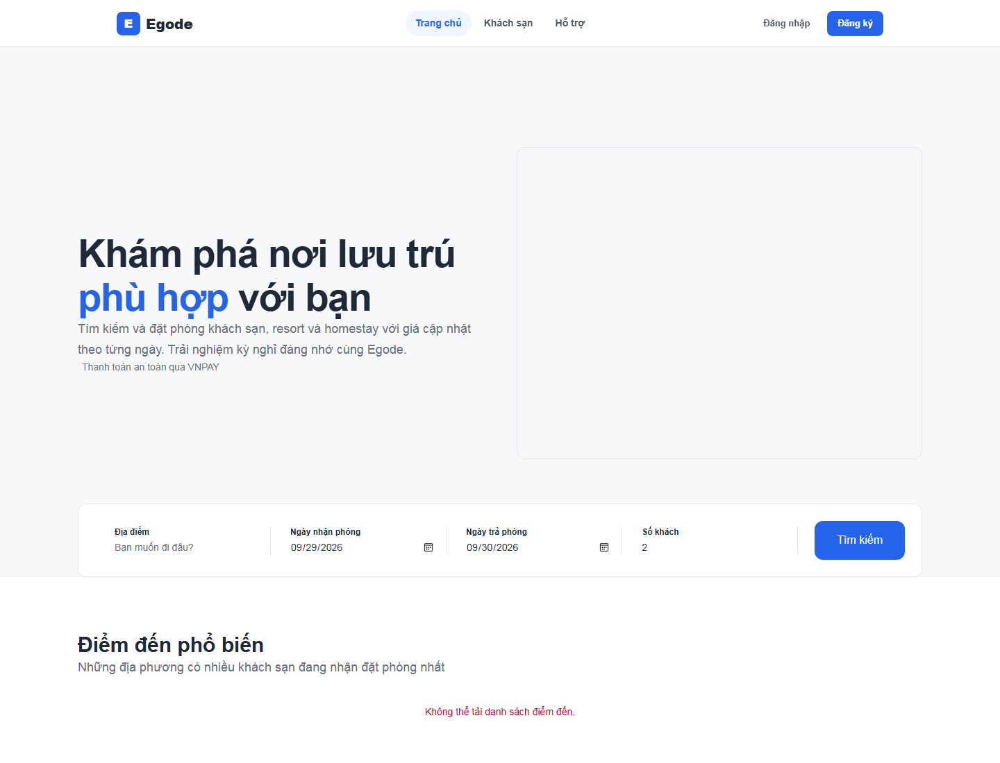
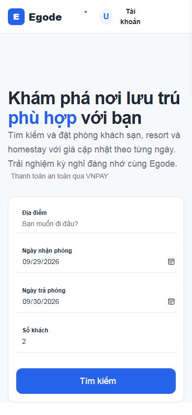
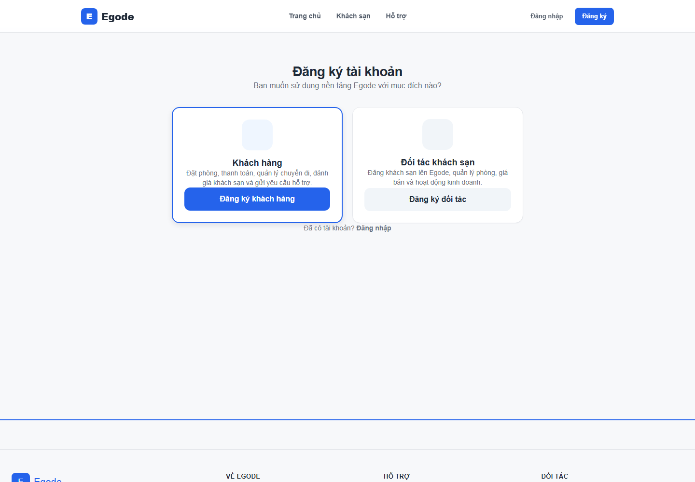
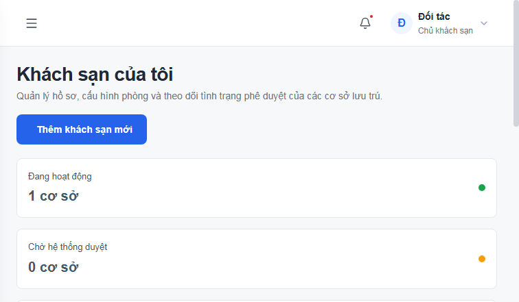
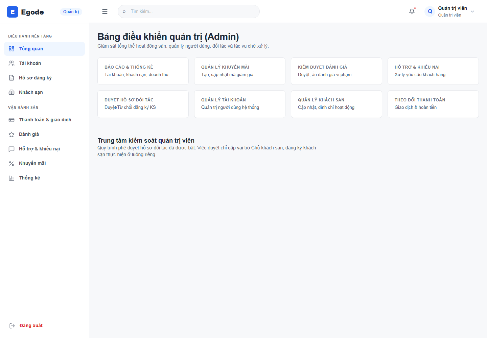
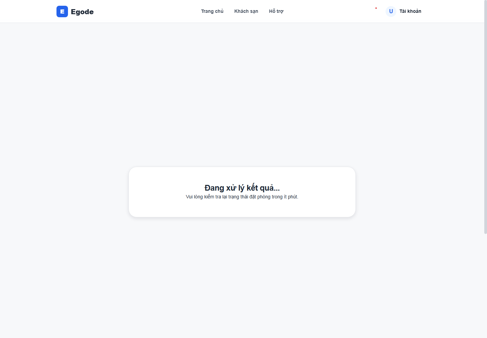

# Egode Phase 1 — Visual QA

**Date:** 28/09/2026  
**Browser:** Microsoft Edge headless, local Vite frontend  
**Scope:** public home, register choice screen, owner hotel list, admin dashboard, payment-result pending state; common controls were reviewed from component source.

## Build and static checks

| Check | Result |
| --- | --- |
| Frontend production build | PASS — TypeScript build and Vite bundle completed |
| Typecheck | PASS — npm.cmd run typecheck |
| ESLint | PASS — npm.cmd run lint |
| Git whitespace check | PASS — git diff --check |
| Automated UI tests | Not run; this phase requests build/typecheck/lint and browser review, not a test-suite change |

## Browser and responsive review

| View | Evidence | Result / limitation |
| --- | --- | --- |
| Public home, desktop 1440px |  | Header, hero hierarchy, search context and section rhythm render. Local backend data was unavailable, so the API-backed hero image/destination content is absent. |
| Public home, mobile 390px |  | Responsive search controls stack; a DOM measurement at 390 CSS px reported document width 390px and no elements extending beyond the viewport. |
| Registration, desktop 1440px |  | Existing account-type choices and page order remain. External Phosphor CDN icons did not load in this isolated browser, leaving their icon slots empty in the capture. |
| Owner hotel list, compact capture 756×441px |  | Capture tooling returned a 756×441 viewport despite requesting 1440×1000. It shows the owner page and KPI styling, but cuts off before the hotel list; desktop layout review is incomplete. The preview used synthetic hotel/auth responses in browser memory only and did not write to backend. |
| Admin dashboard, desktop 1440px |  | Navigation, module links and text-first admin note reviewed. The preview role was injected in browser memory only; no backend operation was invoked. |
| Payment result, desktop 1440px |  | Pending result layout rendered with a visual-preview customer session held in browser memory. No booking identifier was supplied, so no payment-status API query was made. |

Screenshots are after-change evidence. A baseline browser capture was not taken before the audit/code pass, so this report does not claim a pixel before/after comparison. The browser preview ran without the project backend; API-backed production data and authenticated operations were not verified. Owner/admin/customer roles and sample owner hotels were injected in browser memory only to inspect protected screens; no real access token or backend write was used.

## Accessibility baseline

- **Focus:** global focus-visible outline and button/input/select focus styles use the primary action token; reviewed in CSS, not via scripted keyboard traversal.
- **Fields:** common Input/Select/Textarea keep associated labels where supplied, aria-invalid, aria-describedby, and nearby hint/error text.
- **Status:** success, warning and danger badges retain text labels and use darker semantic foregrounds on their subtle surfaces.
- **Reduced motion:** root tokens and base styles reduce transitions/animation when prefers-reduced-motion: reduce is active.
- **Contrast calculation:** primary blue on white is 5.17:1; success text on subtle green is 4.57:1; warning text on subtle amber is 6.37:1; danger text on subtle red is 5.30:1. These checks cover the listed opaque pairs, not every legacy utility combination or non-text boundary.
- **Not automated:** no Playwright or accessibility scanner is installed in the repository. Hover, keyboard interaction, disabled and validation states were source-reviewed but not exhaustively exercised in browser.

## Findings and remaining limits

1. The mobile home screenshot and DOM dimensions show no horizontal overflow at 390px after this pass. The owner screenshot capture did not honor its requested desktop viewport, so owner desktop rendering still needs a fresh browser capture.
2. Phosphor icons are loaded from an external CDN in the current app. That CDN was unavailable in the isolated browser capture; the shared dashboard shell uses the already-installed Lucide React icons. The audit keeps Phosphor as the page-level canonical library and treats Lucide usage as legacy to migrate component-by-component. Icon rendering still depends on the existing CDN in an online environment.
3. The home screenshot shows an empty hero image surface because API data was unavailable. Real hotel imagery and API loading/error states need a connected backend for final product-data review.
4. Only representative screens were adjusted in Phase 1. The remaining page-local Tailwind colors, spacing, radii, and status styles are legacy migration work, not silently treated as fully normalized.
5. No backend, route, booking/payment, API contract, or business behavior was changed by this UI pass.
